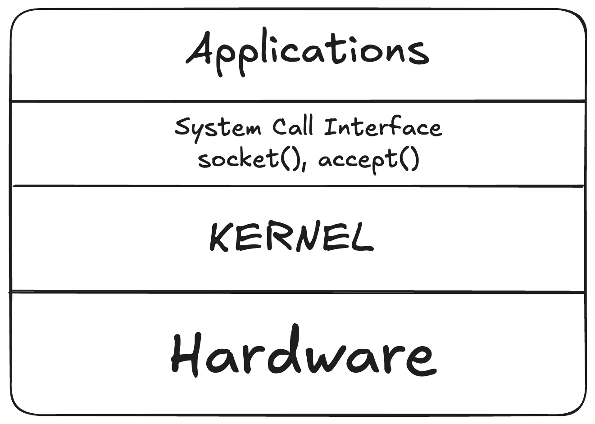

# What is IPC and why do we need it?

IPC is a mechanism using which two or more process running on the same machine exchange their personal data with each other.

- communication between processes running on two different machines are not termed as `IPC`

- Processes running on the same machine, often need to exchange data with each other in order to implement some functionality

- Linux OS provides several mechanism using which user space processes can carry out communications with each other, each mechanism has its own pros and cons.

- Here, we will explore various ways of carrying out IPC on Linux OS however the IPC techniques maps well to other platforms such as windows/MAC os etc. conceptually same.

 The requirement of which is to carry out communication between two application running within the `User Space` and the communication between two application running in `User Space` is termed as `IPC`

## IPC techniques:

- Using Unix Domain Sockets

- Using Network Sockets (can be explored in the future)

- Message Queues

- Shared Memory

- Pipes (not used in the industry thus not covered)

- Signals

The communication processed could be running on the same machine or they can be processed that are actaully running on different physical machines and communicating over the network.

## IPC techniques/communcation : Socket

- These system calls e.g. socket(), accept() invoked by any application (from application layer i.e. user space)
- And by invoking these system calls, the applications actually ask the OS for its service.
- Applications orders the operating system to provide the application some service and this order is done using `system call interface APIs` -> and linux provides a set of APIs for system calls which then applications can invoke to interact with underlying operating system.

- Look at the image below, we will see a `Socket layer` that sits inbetween application layer and OS. and using these APIs the applications instructs the OS to provide its services e.g. malloc(), free() are also system calls which does the same thing.

N.B: right now we only shown/discussed on `socket related system calls`

## Socket message types:

- Messagages (or requests) exchanged between client and server processes can be categorized into two types:

  - Connection initiation request messages
        
        - The msg is used by the client processes to request the server process to establish the dedicated connection.

        - Only after the connection has been fully established, then only client can send `service request messages to server`.
   
   - Service Request Message
        - Client can send these msg to server once the conncetion is fully established.
        - Through these messages, Client requests server to provide a service.

## State machine of socket based client and server communication       